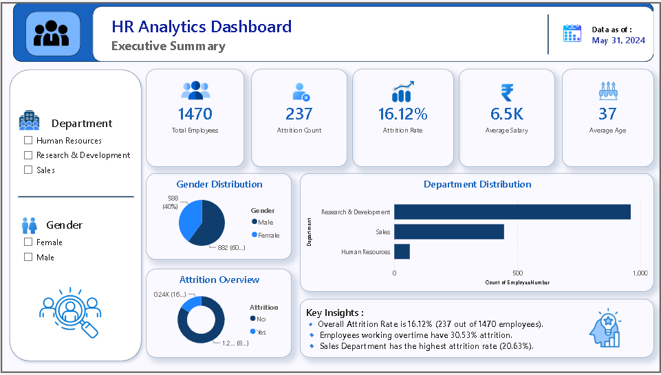
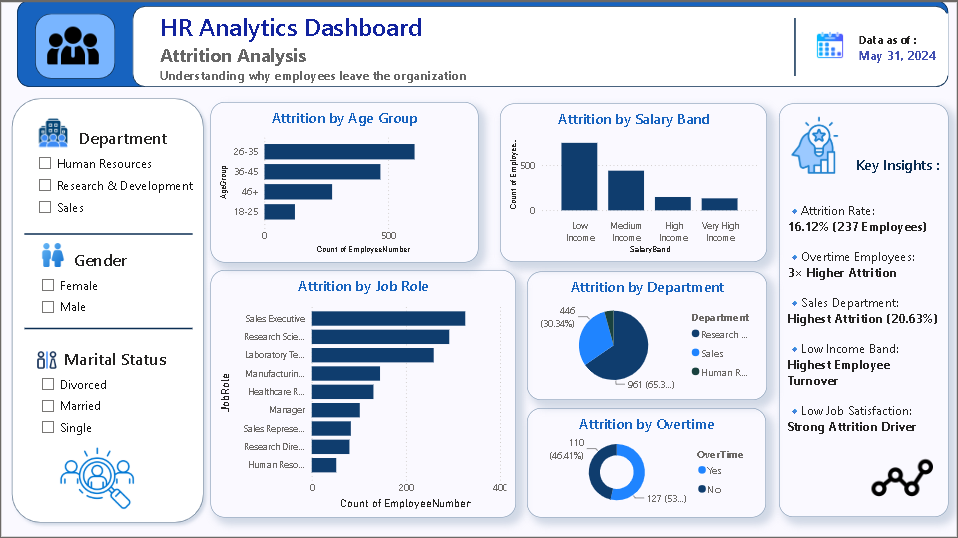
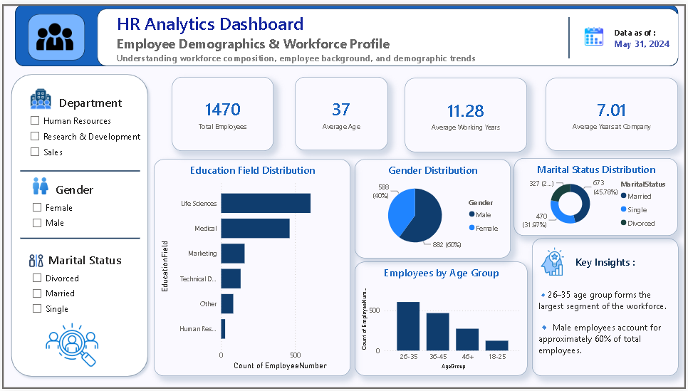
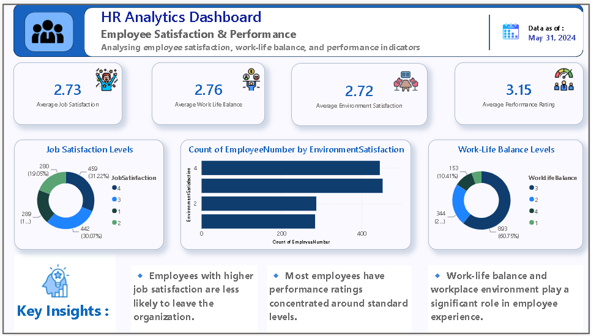
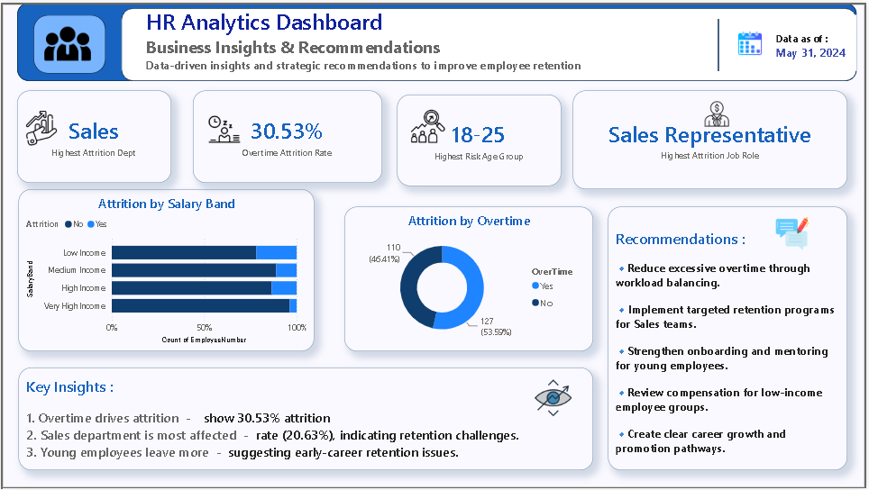

# 📊 HR Analytics Dashboard: Employee Attrition & Workforce Insights

## Overview

This project analyzes employee attrition and workforce trends using Python, SQL, and Power BI. The objective is to identify key factors influencing employee turnover and provide actionable insights to improve employee retention and workforce management.

The project follows a complete analytics workflow:

- Data Cleaning & Transformation (Python)
- Business Query Analysis (SQL)
- Interactive Dashboard Development (Power BI)
- Business Insights & Recommendations

---

## 🎯 Problem Statement

Employee attrition is a major challenge for organizations as it increases recruitment costs, affects productivity, and impacts overall business performance.

The goal of this project is to analyze HR data and identify patterns related to employee attrition, demographics, compensation, and job satisfaction to support data-driven HR decision-making.

---

## 🛠️ Tools & Technologies

- Python
- Pandas
- NumPy
- Matplotlib
- Seaborn
- MySQL
- Power BI
- DAX

---

## 📂 Project Workflow

### 1. Data Cleaning & Preprocessing (Python)

- Checked missing values
- Checked duplicate records
- Removed unnecessary columns
- Created Age Groups
- Created Salary Bands
- Validated data quality

### 2. Exploratory Data Analysis (EDA)

Performed analysis on:

- Age vs Attrition
- Salary vs Attrition
- Overtime vs Attrition
- Department vs Attrition
- Job Satisfaction vs Attrition
- Correlation Analysis

### 3. SQL Business Analysis

Key queries performed:

- Total Employees
- Attrition Count
- Attrition Rate
- Department-wise Attrition
- Gender-wise Attrition
- Overtime Analysis
- Salary Analysis
- Job Role Analysis

### 4. Power BI Dashboard

Developed a 5-page interactive dashboard:

### Page 1 – Executive Summary
- Total Employees
- Attrition Count
- Attrition Rate
- Average Salary
- Average Age

### Page 2 – Attrition Analysis
- Attrition by Department
- Attrition by Age Group
- Attrition by Salary Band
- Attrition by Overtime
- Attrition by Job Role

### Page 3 – Employee Demographics
- Age Distribution
- Gender Distribution
- Marital Status Analysis
- Education Field Analysis

### Page 4 – Employee Satisfaction & Performance
- Job Satisfaction
- Work-Life Balance
- Environment Satisfaction
- Performance Rating

### Page 5 – Business Insights & Recommendations
- Key Findings
- Strategic Recommendations
- High-Risk Employee Segments

---

## 📈 Key Insights

- Overall employee attrition rate is **16.12%**
- Employees working overtime show **30.53% attrition**
- Sales department records the highest attrition rate (**20.63%**)
- Sales Representatives experience the highest attrition (**39.76%**)
- Employees aged **18–25** are the most likely to leave
- Low-income employees show higher turnover compared to high-income employees

---

# 📸 Dashboard Screenshots

## Executive Summary

## Attrition Analysis

## Employee Demographics

## Employee Satisfaction & Performance

## Business Insights & Recommendations

---

## 💡 Business Recommendations

### Reduce Excessive Overtime
Employees working overtime are significantly more likely to leave.

### Improve Sales Team Retention
The Sales department experiences the highest attrition and requires targeted retention strategies.

### Support Early-Career Employees
Employees aged 18–25 show the highest attrition and may benefit from mentorship and onboarding programs.

### Review Compensation Policies
Low-income employees demonstrate higher turnover rates.

### Enhance Employee Satisfaction
Improving workplace satisfaction can help reduce employee attrition.

---

## 📁 Project Structure

HR-Analytics-Dashboard

├── Dataset

│ └── HR_Analytics_Cleaned.csv

├── Python

│ └── HR_Analytics.ipynb

├── SQL

│ └── HR_Analytics_SQL_Queries.sql

├── PowerBI

│ └── HR_Analytics_Dashboard.pbix

├── Screenshots

│ ├── Executive_Summary.png

│ ├── Attrition_Analysis.png

│ ├── Employee_Demographics.png

│ ├── Employee_Satisfaction.png

│ └── Business_Insights.png

└── README.md

---

## 🚀 Future Enhancements

- Employee Attrition Prediction using Machine Learning
- Predictive HR Analytics Dashboard
- Real-Time HR Monitoring System
- Employee Performance Forecasting

---

## 👩‍💻 Author

**Shruti Bunde**

Data Analytics | Python | SQL | Power BI